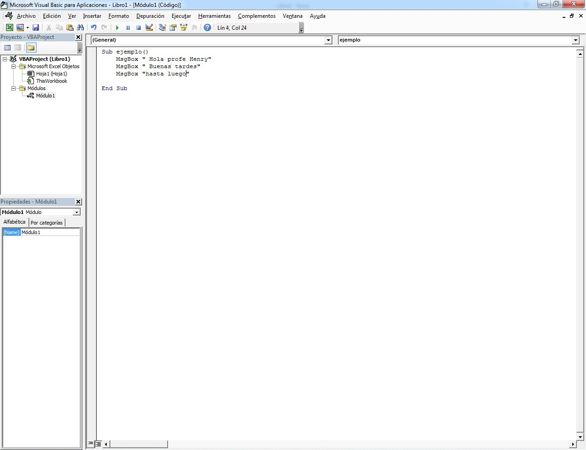
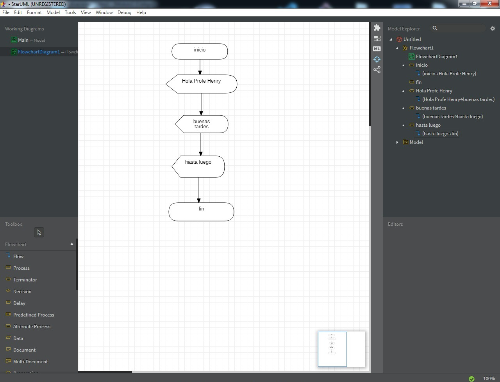

# CLASE  2 SEPTIEMBRE 

Conocimientos basicos sobre programacion, base a algoritmos simples, mediante ejercicios basicos

##  CODIGO DE PRUEBA VISUAL BASIC

```
Sub inicio()
    MsgBox " Hola profe Henry"
    MsgBox " Buenas tardes"
    MsgBox "hasta luego"
End Sub
 ```

 

 ## CODIGO DART

```
void main(){
    print('Hola profe Henry');
}
```
## DIAGRAMA DE FLUJO STAR UML




