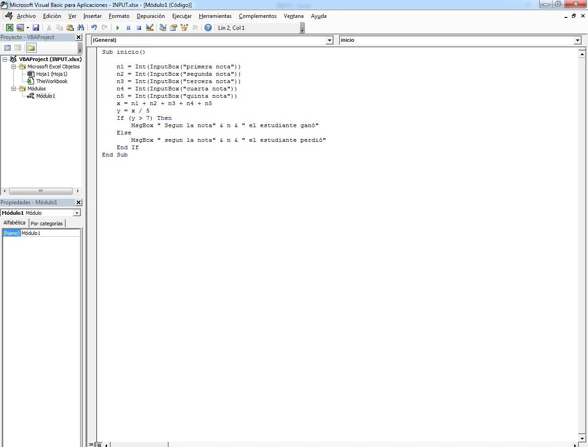
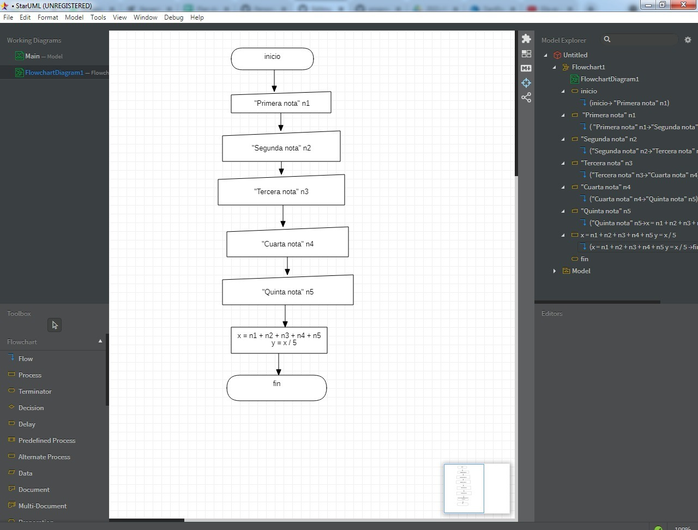

# CLASE  9 DE SEPTIEMBRE 

Sacar el promedio de 5 numeros

# EJERCICIO VISUAL BASIC

```
Sub inicio()

    n1 = Int(InputBox("primera nota"))
    n2 = Int(InputBox("segunda nota"))
    n3 = Int(InputBox("tercera nota"))
    n4 = Int(InputBox("cuarta nota"))
    n5 = Int(InputBox("quinta nota"))
    x = n1 + n2 + n3 + n4 + n5
    y = x / 5
    If (y > 7) Then
        MsgBox " Segun la nota" & n & " el estudiante ganó"
    Else
        MsgBox " segun la nota" & n & " el estudiante perdió"
    End If
End Sub
```



# DIAGRAMA DE FLUJO STAR UML




